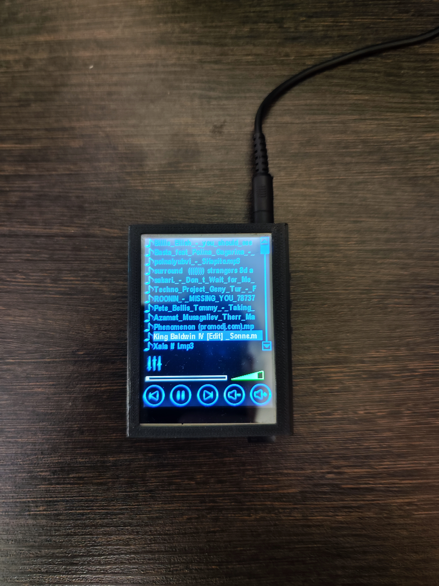

# О проекте

По сути это проект выходного дня. Он представляет собой МР3 плеер с довольно высоким качеством звука. Музыкальные файлы хранятся на карте micro SD.  Файловая система FAT32. Декодирование MP3 выполняется на специализированном DSP. Имеется эквалайзер. Для управления применяется цветной сенсорный TFT дисплей. Батарея литий-ионная. Зарядка от USB. Есть защита от перезаряда и глубокого разряда.

